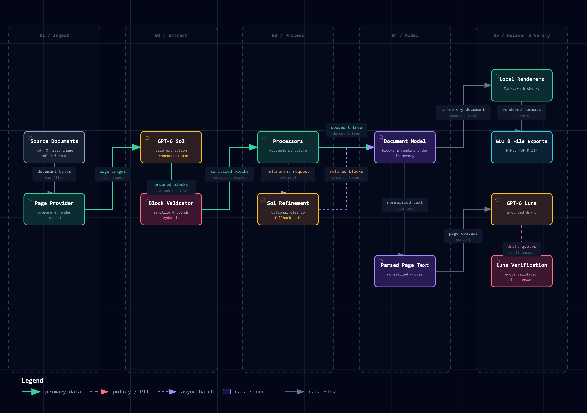

# DocLayout

From scans and images to structured Markdown.

DocLayout turns PDFs, scans, images, and office documents into structured content.
The browser app lets you inspect pages, copy or download results, and ask questions
about the extracted text. You can also use the CLI, Python library, or local HTTP API.

## Features

- GPT-6 Sol reads every selected page, including text, tables, equations,
  headings, reading order, and estimated region coordinates.
- Markdown has a native rendered view and an exact raw view. The separate HTML
  preview uses a white page, serif typography, embedded crops, and MathML.
- Download Markdown, HTML, JSON, chunks, annotated page images, or an annotated
  PDF. The ZIP contains document outputs and excludes the source upload and chat history.
- GPT-6 Luna answers document questions with source-quote checks and a second
  verification request before displaying accepted answers.
- Preview navigation, copying, and downloads reuse completed session results
  without repeating OCR.

## How DocLayout works



## Installation

Install [uv](https://docs.astral.sh/uv/getting-started/installation/). Git is also
needed for GitHub-source installs. The package declares Python `>=3.10,<4`;
Windows checks use Python 3.14. PyPI publication is deferred. The Git commands
below install the current `main` branch, including the
[Unreleased changes](CHANGELOG.md#unreleased). The release wheel installs the
earlier `v2.1.0` tag.
Dependencies still need a reachable package index or a populated local cache.
Before running conversion, [configure API access](#configure-api-access).

### Install as a uv tool

For the CLI and all export formats:

```powershell
uv tool install "git+https://github.com/pypi-ahmad/DocLayout.git@main"
doclayout input.pdf output --all
```

To include the browser app, use this installation instead:

```powershell
uv tool install "doclayout[gui] @ git+https://github.com/pypi-ahmad/DocLayout.git@main"
doclayout_gui
```

If uv reports that its executable directory is missing from PATH, run
`uv tool update-shell` and open a new terminal. Reinstalling with different extras
may require `uv tool install --force` with the desired installation specifier.

### Manual clone

```powershell
git clone https://github.com/pypi-ahmad/DocLayout.git
cd DocLayout
uv sync --locked --group dev --extra full
```

This installs the GUI, API, development tools, and optional document converters.
After configuring credentials, run:

```powershell
uv run doclayout input.pdf output --all
.\launch.cmd
```

The launcher opens http://localhost:8471, stopping the previous listener on
port 8471 first. It disables file watching; restart it after edits.
`doclayout_gui` uses Streamlit's defaults and does not stop a port listener.

### pip or uv pip

Use the Python environment where you want the commands installed. With uv,
create one first if needed using `uv venv`. Choose one installer:

```powershell
uv pip install "doclayout[gui] @ git+https://github.com/pypi-ahmad/DocLayout.git@main"
python -m pip install "doclayout[gui] @ git+https://github.com/pypi-ahmad/DocLayout.git@main"
```

The `v2.1.0` release wheel avoids the Git requirement. Either installer can use
this URL:

```powershell
uv pip install "https://github.com/pypi-ahmad/DocLayout/releases/download/v2.1.0/doclayout-2.1.0-py3-none-any.whl"
```

The wheel command above installs the base CLI. To add extras to a downloaded
wheel, use its local path, for example
`uv pip install ".\doclayout-2.1.0-py3-none-any.whl[gui]"`.

| Installation | Includes |
| --- | --- |
| Base package | CLI/library and every CLI export format |
| `[gui]` | Streamlit workbench |
| `[server]` | Local HTTP API, launched with `doclayout_server` |
| `[full]` | Office/HTML/EPUB document-format converters |
| `[gui,server,full]` | All of the above |

PDFs and images need no GPU or local model downloads. Office/HTML/EPUB conversion
also requires native WeasyPrint libraries; see [format prerequisites](docs/usage.md#installation).
Tool-installed commands run directly as `doclayout ...`. Inside a clone,
`uv run doclayout ...` uses the project's environment.

## Configure API access

DocLayout reads environment variables first. If a value
is absent, it reads `.env` in the launch folder. Each variable follows that order
independently. The GUI, CLI, Python library, and API server share this behavior.

Either set these in the terminal that will launch DocLayout:

```powershell
$env:OPENAI_API_KEY = "your-api-key"
# Optional: set this only for a custom compatible endpoint.
$env:OPENAI_BASE_URL = "https://your-endpoint.example/v1"
```

Or copy [`.env.example`](.env.example) to `.env` in your launch folder and edit it:

```dotenv
OPENAI_API_KEY=your-api-key
# Optional for a custom compatible endpoint:
# OPENAI_BASE_URL=https://your-endpoint.example/v1
```

With `launch.cmd`, the launch folder is the repository root. For an installed
`doclayout_gui` or `doclayout` command, it is the current working directory.
Keep `.env` private; it is excluded from Git and package builds. Restart the app
after credential changes. After changing Windows User/Machine environment
variables, also open a fresh terminal before launching it.

The endpoint must support the app's models and request formats. See
[credentials and persistent Windows setup](docs/configuration.md#credentials-and-environment).

## Command-line examples

```powershell
doclayout input.pdf output
doclayout input.pdf output --all
doclayout input.pdf output --markdown --html
doclayout input.pdf output --json --chunks
doclayout input.pdf output --annotated-pdf --annotated-images
doclayout input.pdf output --zip
doclayout input.pdf output --all --page_range 0,2-4
doclayout --help
```

The default is Markdown with its image crops. `--all` writes every GUI export
and a ZIP after one extraction per selected page. `--zip` alone writes only the
complete archive. Individual format flags can be combined; see the
[full output reference](docs/usage.md#command-line-conversion), including
`--metadata` and `--images`.

CLI files and GUI downloads use `originalfilename_YYYYMMDD_HHMMSS.ext`,
with one UTC timestamp per extraction. JSON variants, crops, and annotated pages
add a type or page suffix. ZIP entries use the same names as loose exports.
File outputs go directly into the requested directory; later runs get new names.
See [filename details](docs/usage.md#output-filenames) for examples.

Folder conversion and the legacy single-file command remain available:

```powershell
doclayout documents --output_dir output --workers 1
doclayout_single input.pdf --output_dir output --output_format markdown
```

GUI Start/End pages are one-based and inclusive. CLI/API page ranges are
zero-based. Extra refinement is optional; OCR always runs through Sol.

## Documentation

| Guide | Contents |
| --- | --- |
| [Usage](docs/usage.md) | Installation, GUI, CLI, Python, API, troubleshooting |
| [Configuration](docs/configuration.md) | Settings, defaults, limits, environment, precedence |
| [Development](docs/development.md) | Setup, tests, builds, extension and prompt-change practices |
| [Changelog](CHANGELOG.md) | Current changes and compatibility history |
| [Architecture](docs/architecture.md) | Extraction pipeline, model calls, renderers, prompts, session state |
| [Validation](docs/gpt6-validation.md) | Dated live observations, offline checks, known limitations |
| [Benchmarks](benchmarks/README.md) | Running a bounded extraction evaluation |
| [Deployment example](examples/README.md) | Optional Modal deployment and its verification limits |

### Interactive diagrams

- [Architecture](docs/diagrams/doclayout-architecture.html)
- [Data flow](docs/diagrams/doclayout-dataflow.html)
- [Lifecycle](docs/diagrams/doclayout-lifecycle.html)
- [Sequence](docs/diagrams/doclayout-sequence.html)
- [Workflow](docs/diagrams/doclayout-workflow.html)

## Accuracy, privacy, and cost

DocLayout sends page images to the configured API endpoint. Chat sends extracted page
text and recent accepted conversation turns. Requests use `store=False`, which
does not replace the endpoint provider's own data-handling policy.

The sidebar shows estimated session API cost for OCR, refinement, and chat.
CLI commands print each conversion's estimate, and document metadata includes
token usage and costs. See [rates and limitations](docs/configuration.md#cost-estimates).

Extraction and chat can incur API charges. Model-estimated boxes are not
confidence scores. Small text, complex tables, equations, and header/footer
classification need review. Document chat verification can also miss mistakes.
There is no claim of perfect accuracy or a general benchmark ranking.

The browser keeps results in session memory. Download them before closing the
session. CLI conversion writes files. The GUI and file command generate HTML
from Markdown. The legacy single-file command, folder conversion, and API render
HTML from document blocks.

## Development

See the [development guide](docs/development.md) for environment setup, offline
and browser checks, explicit live evaluation, package builds, and prompt-change
practices. The [changelog](CHANGELOG.md) records additions and retired interfaces.

Report problems through [DocLayout issues](https://github.com/pypi-ahmad/DocLayout/issues),
after removing secrets and private document contents.

## References and attribution

DocLayout includes code derived from [Marker](https://github.com/datalab-to/marker),
originally developed by Vik Paruchuri and contributors. DocLayout adapts that
foundation for its extraction service, document workbench, chat, and exports.
It is an independent application and does not imply upstream endorsement.

Distributed under the [Apache License 2.0](LICENSE). See [NOTICE](NOTICE) for
attribution and a description of modifications. Optional local benchmark data
has its own [source attribution and setup](tests/data/olmocr_bench/README.md).
