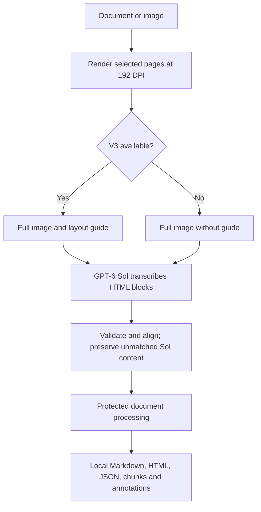

# DocLayout

From scans and images to structured Markdown.

DocLayout turns PDFs, scans, images, and office documents into structured content.
The browser app lets you inspect pages, copy or download results, and ask questions
about the extracted text. You can also use the CLI, Python library, or local HTTP API.

## Features

- GPT-6 Sol transcribes every selected page into text, tables, equations and
  headings. Local PP-DocLayoutV3 supplies layout guidance when available;
  an evaluated matching policy enables confident V3 box and order replacements.
- Sol content is retained when V3 misses or disagrees. If V3 cannot run, Sol
  processes the full image without a layout guide and the result records fallback.
- Markdown has a native rendered view and an exact raw view. The separate HTML
  preview uses a white page, serif typography, embedded crops, and MathML.
- Download Markdown, HTML, JSON, chunks, annotated page images, or an annotated
  PDF. The ZIP contains document outputs and excludes the source upload and chat history.
- GPT-6 Luna answers document questions with source-quote checks and a second
  verification request before displaying accepted answers.
- Preview navigation, copying, and downloads reuse completed session results
  without repeating OCR.

## How DocLayout works



See [architecture](docs/architecture.md) for converter differences, refinement,
and document chat. Local exports reuse one extraction.

## Installation

Install [uv](https://docs.astral.sh/uv/getting-started/installation/). Git is also
needed for GitHub-source installs. The package declares Python `>=3.10,<4`;
V3 guidance requires Python 3.11+ and the `layout` extra; local layout checks
use Python 3.13. PyPI publication is deferred. The Git commands
below install the current `main` branch. The release wheel installs `v3.0.0`;
later changes on `main` are recorded under [Unreleased](CHANGELOG.md#unreleased).
Dependencies still need a reachable package index or a populated local cache.
Before running conversion, [configure API access](#configure-api-access).

### Install as a uv tool

For the CLI and all export formats:

```powershell
uv tool install "doclayout[layout] @ git+https://github.com/pypi-ahmad/DocLayout.git@main"
doclayout input.pdf output --all
```

To include the browser app, use this installation instead:

```powershell
uv tool install "doclayout[gui,layout] @ git+https://github.com/pypi-ahmad/DocLayout.git@main"
doclayout_gui
```

If uv reports that its executable directory is missing from PATH, run
`uv tool update-shell` and open a new terminal. Reinstalling with different extras
may require `uv tool install --force` with the desired installation specifier.

### Manual clone

```powershell
git clone https://github.com/pypi-ahmad/DocLayout.git
cd DocLayout
uv sync --locked --group dev --extra full --extra gui --extra server --extra layout
```

This installs the GUI, API, V3 runtime, development tools, and optional document converters.
After configuring credentials (and optionally an evaluated alignment policy below), run:

```powershell
uv run --extra layout doclayout input.pdf output --all
.\launch.cmd
```

The launcher opens http://localhost:8471 and force-stops any existing listener on
port 8471 before starting. This can interrupt another app or an active conversion.
It disables file watching; restart it after edits.
`doclayout_gui` also binds loopback and leaves existing listeners alone.
The API requires a separate bearer token; see [security limits](docs/configuration.md#security-and-resource-limits).

### pip or uv pip

Use the Python environment where you want the commands installed. With uv,
create one first if needed using `uv venv`. Choose one installer:

```powershell
uv pip install "doclayout[gui,layout] @ git+https://github.com/pypi-ahmad/DocLayout.git@main"
python -m pip install "doclayout[gui,layout] @ git+https://github.com/pypi-ahmad/DocLayout.git@main"
```

The `v3.0.0` release wheel avoids the Git requirement. Either installer can use
this URL:

```powershell
uv pip install "https://github.com/pypi-ahmad/DocLayout/releases/download/v3.0.0/doclayout-3.0.0-py3-none-any.whl"
```

The wheel command above installs the base CLI. To add extras to a downloaded
wheel, use its local path, for example
`uv pip install ".\doclayout-3.0.0-py3-none-any.whl[gui,layout]"`.

| Installation | Includes |
| --- | --- |
| Base package | CLI/library and every CLI export format |
| `[gui]` | Streamlit workbench |
| `[server]` | Local HTTP API, launched with `doclayout_server` |
| `[full]` | Office/HTML/EPUB document-format converters |
| `[gui,server,full]` | All of the above |
| `[layout]` | PP-DocLayoutV3 runtime for local layout guidance |

V3 uses cached local weights but needs no GPU. Office/HTML/EPUB conversion
also requires native WeasyPrint libraries; see [format prerequisites](docs/usage.md#installation).
Tool-installed commands run directly as `doclayout ...`. Inside a clone,
`uv run --extra layout doclayout ...` uses the project's environment.

## Local layout with Sol fallback

Every real GUI, CLI, API, PdfConverter and OCRConverter extraction attempts V3 on
the same whole-page image sent to Sol. Sol receives a compact `given_layout`
guide, then validated blocks are aligned before grouping and processing.
TableConverter uses this same path and retains only its table-related blocks.
If V3 dependencies, cache, preparation, or inference fail, Sol receives the full
image without a guide; its validated boxes, HTML, types, and order are retained.
The GUI warns and metadata records `sol_fallback` and a sanitized error code.
There is no layout-off switch. Invalid configuration, oversized guides, and
downstream layout-invariant violations still fail; corrupt model files trigger Sol fallback.
Sol still reads the full page, transcribes visible content, and writes block HTML;
V3 supplies the layout guide, matched geometry, and reading order, not transcription.
Preview-only operations and base-package imports do not load the runtime.
The extra requires Python 3.11+; native Windows verification uses Python 3.13.
To preserve an existing environment, run from the repository root:

```powershell
$env:UV_PROJECT_ENVIRONMENT = "$PWD\.cache\venvs\layout"
uv sync --python 3.13 --extra layout
```

Without a matching policy, conversion retains Sol's validated boxes and order;
V3 supplies the layout guide when available. To enable confident V3 replacements,
supply all five evaluated alignment parameters through
`DOCLAYOUT_ALIGNMENT_POLICY` (a JSON object), or an `alignment_policy` object in
converter configuration / `--config_json`: `min_iou`, `min_score`,
`min_containment`, `min_area_ratio`, `max_center_distance`. Each is finite and
in `[0, 1]`; no universal thresholds or production defaults are supplied.
An absent policy uses Sol geometry; an explicitly invalid policy fails before
V3 or Sol inference. See
[layout configuration](docs/configuration.md#mandatory-layout-policy) for meanings.
Operator settings also accept `DOCLAYOUT_LAYOUT_DEVICE=auto|cpu|cuda` and
`DOCLAYOUT_LAYOUT_CACHE_DIR`. HTTP requests cannot override these settings.

The guide is limited to 512 regions and 64 KiB UTF-8 per page. Overflow aborts
before that page's Sol request; no regions are silently omitted. Prior concurrent
page requests may finish, but an incomplete document is never exported.
Matched source boxes/order remain protected during processing. Groups preserve
their member order and use union boxes; destructive table merges are skipped.
Optional page correction can edit HTML only, not IDs, types, boxes or order.
Unmatched Sol content keeps its estimated box; unmatched V3 regions remain in
diagnostics without creating empty rendered blocks. Export metadata records the
model, device, policy, region classes/scores, matching decisions and source IDs.
Each page also records region/matched/Sol-only/V3-only counts, preparation time,
page inference time, and sanitized CPU/Sol fallback diagnostics when applicable.
Annotations show V3-derived matched boxes and Sol-estimated unmatched boxes:
rectangles, not irregular masks.

Use the same environment to run your Python caller:

```python
from PIL import Image
from doclayout.services.layout import LayoutService

layout = LayoutService(device="auto")
with Image.open("page.png") as image:
    result = layout.predict(image)
print(result.actual_device, result.provider, result.elapsed_seconds)
for region in result.regions:
    print(region.order_index, region.class_id, region.label, region.score, region.bbox)
    rectangle_corners = region.as_polygon_box()
```

`auto` attempts a CUDA session and a real warm-up inference once. A CUDA setup
or inference failure switches to CPU; a failed page is retried once, and later
pages stay on CPU. `cpu` never probes CUDA. `cuda` is strict: it raises instead
of silently switching to CPU. `provider` reports the validated session's primary
execution provider; a CUDA session can still assign individual operators to CPU.
Identical device/cache settings share a process-wide session and lock, including
across three concurrent callers. Every prediction uses batch size 1.
On the first GUI run, preparation status covers cache verification, any missing
weight download, and warm-up. The result shows the actual CPU/CUDA device; a later
CUDA failure is reflected in the final result, not hidden behind a ready message.
If preparation fails, the GUI warns and conversion continues with Sol. The
standalone `LayoutService.prepare()` and `predict()` methods still raise typed
errors; Sol fallback belongs to the conversion pipeline, not the standalone service.

`launch.cmd` uses `uv run --frozen --extra gui --extra layout`: it installs from
the existing lock without updating it. It remains bound to `127.0.0.1:8471` and
force-stops existing listeners on that port, then waits for it to become free.
If cleanup fails, startup aborts with an error. No GPU is required.

The pinned ONNX Runtime GPU 1.30.0 package includes CPU execution. Its Windows
CUDA path requires CUDA 13.x, cuDNN 9.x, and the VC++ runtime; DLLs must be
discoverable on PATH or by ORT's preloader. No PaddlePaddle or Torch runtime is
installed. See the [ORT CUDA requirements](https://onnxruntime.ai/docs/execution-providers/CUDA-ExecutionProvider.html)
and [Windows requirements](https://onnxruntime.ai/docs/install/#requirements).
The base OpenCV dependency is the single contrib distribution required by
PaddleOCR; do not also install headless OpenCV in this environment.

First preparation or prediction loads the [official ONNX artifact](https://huggingface.co/PaddlePaddle/PP-DocLayoutV3_onnx/tree/46bbdf188bb0a772c08aed74882ce7e51a8f1ea6),
revision `46bbdf188bb0a772c08aed74882ce7e51a8f1ea6`. Only absent `inference.onnx`
and `inference.yml` files are downloaded. Sizes and SHA-256 hashes are checked
before loading. The default cache is `.cache/layout` under the working directory
(ignored by Git here); `cache_dir` overrides it. Explicit Paddle/Xet cache
environment settings are respected. Importing or constructing the service does
not import the optional runtime, download weights, or initialize a session.
This runtime uses PaddleOCR's ONNX Runtime engine. Transformers/safetensors
weights are not loaded by this implementation, even if separately cached.

Results contain model/revision, actual device/provider, image `(width, height)`,
elapsed seconds, and immutable ordered regions. Timing excludes initial loading,
warm-up, and queue waiting, but includes an inference fallback retry. Regions
retain original class IDs/labels, scores, page-pixel rectangles, and one-based
reading order, including graphics. PaddleOCR handles preprocessing, score
filtering (artifact default 0.5), and decoding. The standalone service does not
align content; conversion applies the separately configured conservative aligner.
Rectangle mode exposes no native polygons or
masks: `as_polygon_box()` derives four rectangle corners only.

Failures use `LayoutDependencyError`, `LayoutCacheError`, `LayoutArtifactError`,
`LayoutDeviceError`, or `LayoutInferenceError`, all under `LayoutError`.
Startup failures are remembered until process restart. Corrupt cached artifacts
are never silently replaced: repair/remove only the named corrupt file (and its
backing Hub blob if symlinked), then restart. Revision changes require reviewing
the official interface, updating both file hashes/sizes in the service, and
rerunning the layout tests and local CPU/CUDA smoke checks. The model revision
does not track `main`; source-install commands above do.

## Configure API access

DocLayout reads environment variables first. If a value
is absent, it reads `.env` in the launch folder. Each variable follows that order
independently. The GUI, CLI, Python library, and API server share this behavior.

Either set these in the terminal that will launch DocLayout:

```powershell
$env:OPENAI_API_KEY = "your-api-key"
# Optional: set this only for a custom compatible endpoint.
$env:OPENAI_BASE_URL = "https://your-endpoint.example/v1"
```

Or copy [`.env.example`](.env.example) to `.env` in your launch folder and edit it:

```dotenv
OPENAI_API_KEY=your-api-key
# Optional for a custom compatible endpoint:
# OPENAI_BASE_URL=https://your-endpoint.example/v1
```

With `launch.cmd`, the launch folder is the repository root. For an installed
`doclayout_gui` or `doclayout` command, it is the current working directory.
Keep `.env` private; it is excluded from Git and package builds. Restart the app
after credential changes. After changing Windows User/Machine environment
variables, also open a fresh terminal before launching it.

The endpoint must support the app's models and request formats. See
[credentials and persistent Windows setup](docs/configuration.md#credentials-and-environment).

## Command-line examples

```powershell
doclayout input.pdf output
doclayout input.pdf output --all
doclayout input.pdf output --markdown --html
doclayout input.pdf output --json --chunks
doclayout input.pdf output --annotated-pdf --annotated-images
doclayout input.pdf output --zip
doclayout input.pdf output --all --page_range 0,2-4
doclayout --help
```

The default is Markdown with its image crops. `--all` writes every GUI export
and a ZIP after one extraction per selected page. `--zip` alone writes only the
complete archive. Individual format flags can be combined; see the
[full output reference](docs/usage.md#command-line-conversion), including
`--metadata` and `--images`.

CLI files and GUI downloads use `originalfilename_YYYYMMDD_HHMMSS.ext`,
with one UTC timestamp per extraction. JSON variants, crops, and annotated pages
add a type or page suffix. ZIP entries use the same names as loose exports.
File outputs go directly into the requested directory; later runs get new names.
See [filename details](docs/usage.md#output-filenames) for examples.

Folder conversion and the legacy single-file command remain available:

```powershell
doclayout documents --output_dir output --workers 1
doclayout_single input.pdf --output_dir output --output_format markdown
```

GUI Start/End pages are one-based and inclusive. CLI/API page ranges are
zero-based. Extra refinement is optional; OCR always runs through Sol.

## Documentation

| Guide | Contents |
| --- | --- |
| [Usage](docs/usage.md) | Installation, GUI, CLI, Python, API, troubleshooting |
| [Configuration](docs/configuration.md) | Settings, defaults, limits, environment, precedence |
| [Development](docs/development.md) | Setup, tests, builds, extension and prompt-change practices |
| [Changelog](CHANGELOG.md) | Current changes and compatibility history |
| [Architecture](docs/architecture.md) | Extraction pipeline, model calls, renderers, prompts, session state |
| [Validation](docs/gpt6-validation.md) | Dated live observations, offline checks, known limitations |
| [Benchmarks](benchmarks/README.md) | Running a bounded extraction evaluation |
| [Deployment example](examples/README.md) | Optional Modal deployment and its verification limits |

### Interactive diagrams

- [Architecture](docs/diagrams/doclayout-architecture.html)
- [Data flow](docs/diagrams/doclayout-dataflow.html)
- [Lifecycle](docs/diagrams/doclayout-lifecycle.html)
- [Sequence](docs/diagrams/doclayout-sequence.html)
- [Workflow](docs/diagrams/doclayout-workflow.html)

## Accuracy, privacy, and cost

DocLayout sends page images to the configured API endpoint. Chat sends extracted page
text and recent accepted conversation turns. Requests use `store=False`, which
does not replace the endpoint provider's own data-handling policy.

The sidebar shows estimated session API cost for OCR, refinement, and chat.
CLI commands print each conversion's estimate, and document metadata includes
token usage and costs. See [rates and limitations](docs/configuration.md#cost-estimates).

Extraction and chat can incur API charges. Model-estimated boxes are not
confidence scores. Small text, complex tables, equations, and header/footer
classification need review. Document chat verification can also miss mistakes.
There is no claim of perfect accuracy or a general benchmark ranking.

The browser keeps results in session memory. Download them before closing the
session. CLI conversion writes files. The GUI and file command generate HTML
from Markdown. The legacy single-file command, folder conversion, and API render
HTML from document blocks.

## Development

See the [development guide](docs/development.md) for environment setup, offline
and browser checks, explicit live evaluation, package builds, and prompt-change
practices. The [changelog](CHANGELOG.md) records additions and retired interfaces.

Report problems through [DocLayout issues](https://github.com/pypi-ahmad/DocLayout/issues),
after removing secrets and private document contents.

## References and attribution

DocLayout includes code derived from [Marker](https://github.com/datalab-to/marker),
originally developed by Vik Paruchuri and contributors. DocLayout adapts that
foundation for its extraction service, document workbench, chat, and exports.
It is an independent application and does not imply upstream endorsement.

Distributed under the [Apache License 2.0](LICENSE). See [NOTICE](NOTICE) for
attribution and a description of modifications. Optional local benchmark data
has its own [source attribution and setup](tests/data/olmocr_bench/README.md).
