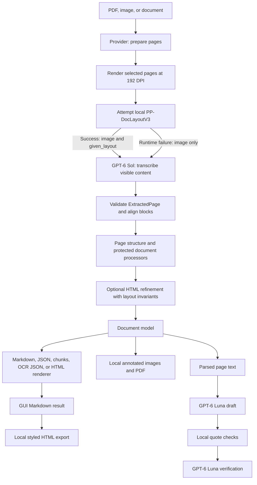

# DocLayout architecture

[Back to README](../README.md) · [Configuration](configuration.md) · [Development](development.md)

## Data flow

### Interactive architecture and workflow diagrams

Open these standalone HTML diagrams of the architecture and workflows:

- [System architecture](diagrams/doclayout-architecture.html): Local V3, external Sol, alignment, processing, and output boundaries.
- [Conversion workflow](diagrams/doclayout-workflow.html): Page rendering, optional V3 guidance, Sol fallback, validation, and exports.
- [Chat verification sequence](diagrams/doclayout-sequence.html): Luna draft, local quote checks, and independent verification.
- [Data flow](diagrams/doclayout-dataflow.html): Page images, region data, validated content, and local exports.
- [Processing lifecycle](diagrams/doclayout-lifecycle.html): Model preparation, page extraction, fallback, completion, and fatal errors.

All five pass Archify's showcase checks and fit the checked desktop viewports
from 1440×900 through 2048×1320 without page scrolling. The diagrams reflect
the current code and tests; the [dated validation notes](gpt6-validation.md#documentation-sync-2026-09-26)
record earlier diagram revisions.

## Extraction

Providers handle input formats. Office, HTML, and EPUB inputs become temporary
PDFs. The GUI keeps the prepared PDF bytes in session memory so preview and
extraction can reuse them.

The document builder renders each selected page at 192 DPI by default. PDFium
renders pages one at a time. The same whole-page image first attempts
PP-DocLayoutV3 using PaddleOCR's ONNX Runtime engine, batch size 1. Sol receives
the image and a bounded `given_layout` guide (512 regions, 64 KiB maximum).
If V3 cannot run, the request contains the full image and no guide.
A limited thread pool sends page images for extraction;
the shared Sol service permits at most three concurrent requests per process.
Every selected page goes through image extraction, including pages with embedded
PDF text.

Sol transcribes content and returns blocks with type, HTML, and estimated bounds normalized
to 0 to 1000. Pydantic validation rejects invalid geometry and inconsistent blank
pages. Deterministic alignment converts both coordinate systems into page space
before creating blocks. Confident one-to-one matches keep Sol HTML/type and use
V3 rectangles and order in `page.structure`. Ambiguous splits/merges retain Sol
content and boxes; unmatched V3 regions remain diagnostics, not empty blocks.
With no evaluated matching policy, alignment instead preserves all validated Sol
blocks and their order/geometry, while retaining the available V3 guide and
diagnostics. Metadata marks this `sol_geometry` mode and `policy_not_configured`;
no matching thresholds are invented. Existing processor invariants still apply.
Structure groups retain member order and use union boxes. Invariant checks after
processors protect source IDs, types, geometry, and order; destructive table
merging is skipped. Page correction may edit validated HTML only. Invalid replies
are ignored atomically and recorded; a layout invariant violation aborts conversion.
A V3 runtime failure sends the full image to Sol without a guide and preserves
validated Sol geometry/order with `sol_fallback` diagnostics. A successful empty
V3 result remains distinct from a failed detector. Sol extraction, configuration,
guide-limit, and downstream block-integrity failures still abort the document.

The existing model lifecycle constructs a lazy layout service alongside the Sol
client. Services with identical device/cache settings share one locked runtime.
`prepare()` verifies pinned artifacts and performs one real warm-up; prediction
uses that same session. CPU never probes CUDA; auto mode falls back to CPU and
stays there after a CUDA failure; explicit CUDA fails instead. Startup failures
remain cached until process restart. Base imports do not require the layout extra.
These errors are raised by the standalone service and handled as Sol fallback by
conversion. No runtime path loads Transformers or safetensors weights.

`PdfConverter` groups the aligned source blocks with `StructureBuilder` before
running processors. `OCRConverter` uses the same rendering, extraction, and
alignment path but skips grouping and default processors, then returns OCR JSON.
`TableConverter` retains only tables, forms, and tables of contents; its intentional
filtering is recorded in layout diagnostics.

## Rendering and output ownership

The GUI builds one document, then renders Markdown, hierarchical JSON, and flat
chunks from it. Local code generates styled HTML from the resulting Markdown,
draws V3-derived matched boxes and Sol-estimated unmatched boxes on copies of
source images, creates a raster PDF, and
assembles the ZIP. These operations do not call a model.

The file command builds one document and uses the same Markdown-to-HTML,
annotation, and ZIP helpers as the GUI. It renders the selected representations
locally, with no extra inference for additional formats. File exports use UTF-8;
Markdown includes its crops, and HTML embeds them.

Folder conversion, the legacy single-file command, and the API select one
renderer. Their HTML comes from document blocks. Legacy CLI output has separate
metadata; the API returns metadata alongside the serialized output. The new file
command writes a separate metadata file only when selected, while its JSON and
chunks representations include metadata.

The document model stores pages, blocks, reading order, images, and metadata.
It also carries reported extraction and refinement usage into rendered metadata.
Local code prices that usage at the configured rates. Chat keeps a separate
usage record, and the GUI adds both models' costs across the browser session.
Geometry is estimated. The app does not provide character positions or calibrated
confidence scores. Rendering depends on the extracted blocks and subsequent
processing.
Dedicated per-page layout metadata contains model/revision, actual primary ORT
provider, device, preparation and inference timings, original region diagnostics,
and alignment-time counts. Filtering is recorded separately. Preparation time is
shared-session startup time, repeated as provenance, not a per-page cost to sum.
Page inference time excludes startup and lock waiting; a page retry includes its
CPU fallback work. Failed V3 attempts instead include any lazy startup in elapsed
time and report `actual_device`/`provider: unavailable` with an `error_code`.
Layout diagnostics do not enter additive `BlockMetadata`.

## Frontend state and chat

Only Run DocLayout triggers page extraction. The active result belongs to the
current upload and settings. Changing either clears results and chat.
Preview, raw/rendered switching, clipboard actions, and downloads reuse the
completed result. The GUI keeps artifacts in memory and has no persistent run store.
The existing `cache_resource` helper owns model clients. Explicit conversion shows
layout preparation status, then actual CPU/CUDA readiness; final page metadata
updates the displayed device if inference subsequently falls back. Preparation
errors remain visible while Sol fallback can produce a result. Preview never prepares V3.

Chat uses a separate Luna client and token usage record. The draft schema contains
statements and supporting page quotes. The application checks that each quote
exists in the identified page text after whitespace normalization, validates
answer length/style, and requests independent verification. Only approved
answers receive page citations generated by the app. Mistakes can still pass
these checks.

## Prompts and schemas

| Resource | Purpose |
| --- | --- |
| `doclayout/prompts/system.md` | Shared Sol instructions |
| `doclayout/prompts/extraction.md` | Whole-page extraction instructions |
| `doclayout/prompts/chat-answer.md` | Document-grounded chat draft |
| `doclayout/prompts/chat-verify.md` | Independent chat verification |
| `doclayout/processors/llm/` | Refinement prompt strings still embedded in Python |

Markdown resources are loaded once when their modules are imported using
`importlib.resources`. Restart the application after editing them. They are
included in the built package. `.gitattributes` preserves their bytes, and tests
check prompt fingerprints against the approved expectations. See [prompt-change practices](development.md#preserve-extraction-behavior)
before editing prompt content or its fingerprint expectations.

Schemas and request logic remain in Python.

## Code map and extension boundaries

| Package | Responsibility |
| --- | --- |
| `providers` | Input-format preparation and page rendering |
| `builders` | Document creation and structural relationships |
| `schema` | Pages, blocks, polygons, extraction validation |
| `processors` | Document processing and optional refinement |
| `renderers` | Markdown, HTML, hierarchical/flat JSON representations |
| `services` | Shared Sol client/accounting and lazy locked local layout runtime |
| `ui` | Session helpers, local exports, clipboard component, Luna chat |
| `scripts` | CLI, Streamlit, and HTTP entry points |
| `config` | Configuration parsing, discovery, and retired-option rejection |

See [development practices](development.md#preserve-extraction-behavior) for
extension checks and safe changes to extraction, rendering, and prompts.
[Configuration](configuration.md) owns defaults and controls;
[validation](gpt6-validation.md) records observed behavior and limitations.

### Provider extension contract

Providers supply prepared pages, rendering, bounds, references, and page
selection. The builder creates blocks from structured model responses.
The former provider-line and page-line merging interfaces have been removed;
see the [changelog](../CHANGELOG.md#210-2026-09-23) for the complete retirement list.
