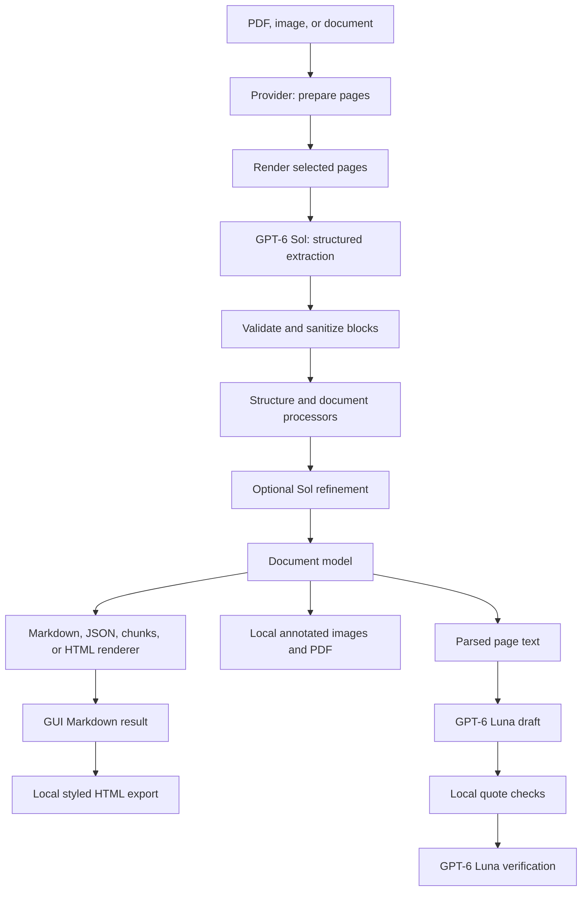

# DocLayout architecture

[Back to README](../README.md)

## Data flow

## Extraction

Providers handle input formats. Office, HTML, and EPUB inputs become temporary
PDFs. The GUI retains prepared PDF bytes in session memory so preview and
extraction reuse that preparation.

The document builder renders each selected page at 192 DPI by default. PDFium
rendering is serialized. A bounded thread pool sends page images for extraction;
the shared Sol service permits at most three concurrent requests per process.
Embedded PDF text never bypasses page extraction.

The model returns ordered blocks with type, HTML, and estimated bounds normalized
to 0–1000. Pydantic validation rejects invalid geometry and inconsistent blank
pages. HTML is sanitized, coordinates are mapped into page space, and structure
processors prepare the document for rendering. Optional refinement uses the
same Sol service. Refinement failures retain baseline content and record errors;
page extraction failures abort that document.

## Rendering and output ownership

The GUI builds one document, then renders Markdown, hierarchical JSON, and flat
chunks from it. Local code generates styled HTML from the resulting Markdown,
draws estimated boxes on copies of source images, creates a raster PDF, and
assembles the ZIP. These operations do not call a model.

The CLI and API select one document renderer. Their HTML renderer operates on
document blocks; it is not the GUI's Markdown-to-HTML exporter. The CLI writes
metadata separately, while the API returns it alongside the serialized output.

The document model stores pages, blocks, reading order, images, and metadata.
Geometry is estimated, without character-level positions or calibrated
confidence scores. Rendering can preserve structure only as well as extraction
and subsequent processing provide it.

## Frontend state and chat

Only Run DocLayout triggers page extraction. Upload identity and processing
settings define the active result; changing either clears results and chat.
Preview, raw/rendered switching, clipboard actions, and downloads reuse the
completed result. GUI artifacts stay in memory rather than a persistent run store.

Chat uses a separate Luna client and token-usage record. The draft schema contains
statements and supporting page quotes. The application checks that each quote
exists in the identified page text after whitespace normalization, validates
answer length/style, and requests independent verification. Only approved
answers receive application-generated page citations. This reduces unsupported
answers but is not a guarantee of correctness.

## Prompts and schemas

| Resource | Purpose |
| --- | --- |
| `doclayout/prompts/system.md` | Shared Sol instructions |
| `doclayout/prompts/extraction.md` | Whole-page extraction instructions |
| `doclayout/prompts/chat-answer.md` | Document-grounded chat draft |
| `doclayout/prompts/chat-verify.md` | Independent chat verification |
| `doclayout/processors/llm/` | Refinement prompt strings still embedded in Python |

Markdown resources are loaded once when their modules are imported using
`importlib.resources`. Restart the application after editing them. They are
included in the built package. `.gitattributes` preserves their bytes, and tests
check prompt fingerprints against the original strings. Organizational changes
must not alter whitespace or placeholders. Intentional prompt changes require
separate review and evaluation before updating those fingerprints.

Schemas and request logic remain in Python. The prompt files are runtime input,
not user documentation; documentation edits must leave them unchanged.

## Code map and extension boundaries

| Package | Responsibility |
| --- | --- |
| `providers` | Input-format preparation and page rendering |
| `builders` | Document creation and structural relationships |
| `schema` | Pages, blocks, polygons, extraction validation |
| `processors` | Document processing and optional refinement |
| `renderers` | Markdown, HTML, hierarchical/flat JSON representations |
| `services` | Shared Sol client and request accounting |
| `ui` | Session helpers, local exports, clipboard component, Luna chat |
| `scripts` | CLI, Streamlit, and HTTP entry points |
| `config` | Configuration parsing, discovery, and retired-option rejection |

Keep frontend/export changes outside extraction prompts and processors unless
the intended task explicitly changes extraction behavior. Rendering, chat,
and model inference need separate tests. Offline tests establish contracts and
regression behavior; live model accuracy requires explicitly authorized,
billable evaluation. See [validation](gpt6-validation.md).
