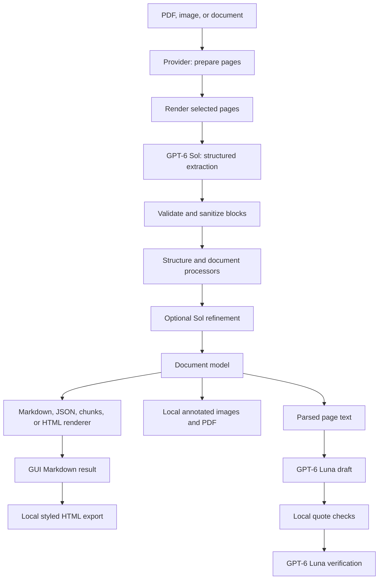

# DocLayout architecture

[Back to README](../README.md) · [Configuration](configuration.md) · [Development](development.md)

## Data flow

Download the [data flow](diagrams/doclayout-dataflow.html) or
[system architecture](diagrams/doclayout-architecture.html) HTML file to explore
the diagram in a browser.

## Extraction

Providers handle input formats. Office, HTML, and EPUB inputs become temporary
PDFs. The GUI keeps the prepared PDF bytes in session memory so preview and
extraction can reuse them.

The document builder renders each selected page at 192 DPI by default. PDFium
renders pages one at a time. A limited thread pool sends page images for extraction;
the shared Sol service permits at most three concurrent requests per process.
Every selected page goes through image extraction, including pages with embedded
PDF text.

The model returns ordered blocks with type, HTML, and estimated bounds normalized
to 0 to 1000. Pydantic validation rejects invalid geometry and inconsistent blank
pages. The app sanitizes HTML and maps coordinates into page space. Structure
processors then prepare the document for rendering. Optional refinement uses the
same Sol service. If refinement fails, the app keeps the extracted content and
records errors. A page extraction failure aborts the document.

## Rendering and output ownership

The GUI builds one document, then renders Markdown, hierarchical JSON, and flat
chunks from it. Local code generates styled HTML from the resulting Markdown,
draws estimated boxes on copies of source images, creates a raster PDF, and
assembles the ZIP. These operations do not call a model.

The file command builds one document and uses the same Markdown-to-HTML,
annotation, and ZIP helpers as the GUI. It renders the selected representations
locally, with no extra inference for additional formats. File exports use UTF-8;
Markdown includes its crops, and HTML embeds them.

Folder conversion, the legacy single-file command, and the API select one
renderer. Their HTML comes from document blocks. Legacy CLI output has separate
metadata; the API returns metadata alongside the serialized output. The new file
command writes a separate metadata file only when selected, while its JSON and
chunks representations include metadata.

The document model stores pages, blocks, reading order, images, and metadata.
It also carries reported extraction and refinement usage into rendered metadata.
Local code prices that usage at the configured rates. Chat keeps a separate
usage record, and the GUI adds both models' costs across the browser session.
Geometry is estimated. The app does not provide character positions or calibrated
confidence scores. Rendering depends on the extracted blocks and subsequent
processing.

## Frontend state and chat

Only Run DocLayout triggers page extraction. The active result belongs to the
current upload and settings. Changing either clears results and chat.
Preview, raw/rendered switching, clipboard actions, and downloads reuse the
completed result. The GUI keeps artifacts in memory and has no persistent run store.

Chat uses a separate Luna client and token usage record. The draft schema contains
statements and supporting page quotes. The application checks that each quote
exists in the identified page text after whitespace normalization, validates
answer length/style, and requests independent verification. Only approved
answers receive page citations generated by the app. Mistakes can still pass
these checks.

## Prompts and schemas

| Resource | Purpose |
| --- | --- |
| `doclayout/prompts/system.md` | Shared Sol instructions |
| `doclayout/prompts/extraction.md` | Whole-page extraction instructions |
| `doclayout/prompts/chat-answer.md` | Document-grounded chat draft |
| `doclayout/prompts/chat-verify.md` | Independent chat verification |
| `doclayout/processors/llm/` | Refinement prompt strings still embedded in Python |

Markdown resources are loaded once when their modules are imported using
`importlib.resources`. Restart the application after editing them. They are
included in the built package. `.gitattributes` preserves their bytes, and tests
check prompt fingerprints against the original strings. See [prompt-change practices](development.md#preserve-extraction-behavior)
before editing prompt content or its fingerprint expectations.

Schemas and request logic remain in Python.

## Code map and extension boundaries

| Package | Responsibility |
| --- | --- |
| `providers` | Input-format preparation and page rendering |
| `builders` | Document creation and structural relationships |
| `schema` | Pages, blocks, polygons, extraction validation |
| `processors` | Document processing and optional refinement |
| `renderers` | Markdown, HTML, hierarchical/flat JSON representations |
| `services` | Shared Sol client and request accounting |
| `ui` | Session helpers, local exports, clipboard component, Luna chat |
| `scripts` | CLI, Streamlit, and HTTP entry points |
| `config` | Configuration parsing, discovery, and retired-option rejection |

See [development practices](development.md#preserve-extraction-behavior) for
extension checks and safe changes to extraction, rendering, and prompts.
[Configuration](configuration.md) owns defaults and controls;
[validation](gpt6-validation.md) records observed behavior and limitations.

### Provider extension contract

Providers supply prepared pages, rendering, bounds, references, and page
selection. The builder creates blocks from structured model responses.
The former provider-line and page-line merging interfaces have been removed;
see the [changelog](../CHANGELOG.md#210-2026-09-23) for the complete retirement list.
