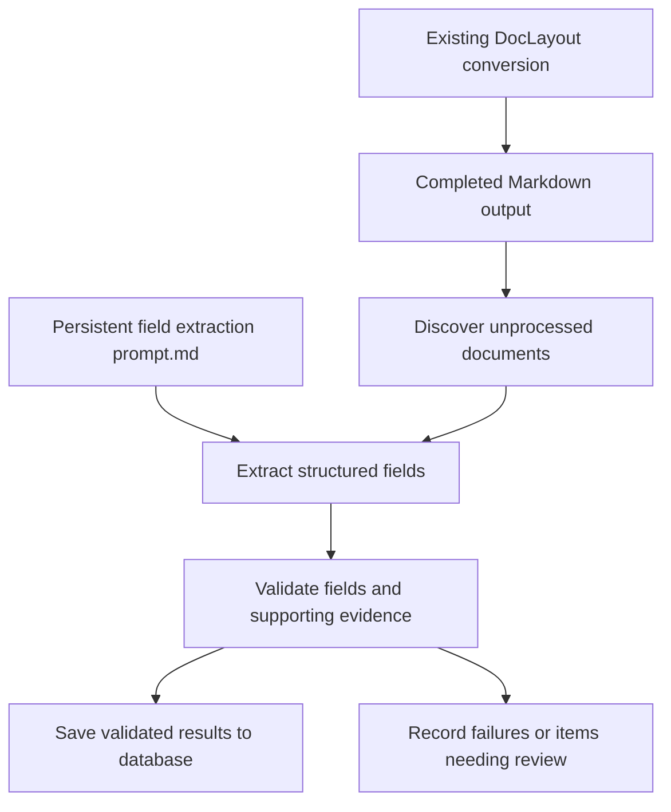

# Plan: field extraction after Markdown generation

Date: 2026-09-23
Status: Future work only. Implementation and deployment are not authorized by this plan.

## Purpose and boundary

Add a separate pipeline that reads the Markdown already produced by DocLayout,
extracts specified fields, validates the results, and stores them in a database.

Preserve the current PDF-to-Markdown implementation, CLI, prompts, model settings,
and export behavior. The new work starts at the completed Markdown output. It must
not require changes to the existing conversion path or rerun PDF conversion when
Markdown is already available.

The intended upstream workflow accepts incoming PDFs and converts all pages.
Users do not need to select pages. The downstream pipeline must consider all
available Markdown content; it must not silently truncate long documents.

## What we agreed today

- Implementation will happen later; this document records the plan only.
- Field extraction is a separate step after Markdown generation.
- A persistent `.md` prompt defines the required fields, their descriptions, and
  extraction instructions.
- The same prompt is reused for incoming documents until deliberately updated.
- Validated extracted fields are stored in a database.
- Azure Databricks is the proposed deployment environment discussed today.

The model, database, and operational choices below are recommendations to confirm
when implementation begins, rather than already implemented capabilities.

## Proposed workflow



1. Read completed Markdown from the existing output location. Preserve a reference
   to its source PDF and existing metadata when available.
2. Load the persistent extraction prompt and the agreed output schema.
3. Check processing records to identify new documents or explicitly requested
   reprocessing.
4. Extract the requested fields as structured JSON.
5. Validate the JSON structure, field types, required rules, and source evidence.
6. Save successful results and record processing status. Keep failed or ambiguous
   results available for retry or review.

## Bidirectional field-to-PDF grounding

The future extraction UI should connect every supported extracted field to its
source region in the original document. The interaction should work in both
directions:

- Hovering over or selecting an extracted field highlights its supporting region
  on the corresponding PDF page.
- Hovering over or selecting a grounded PDF region highlights the extracted
  fields supported by that region.
- Selecting either side may lock the selection and scroll the other view to the
  matching field or page.

The downstream extractor must therefore consume grounded blocks rather than
plain Markdown alone. Use the existing chunk output, or an equivalent internal
representation, to provide block IDs, page numbers, text, bounding boxes, and
polygons alongside the content presented to the model. Each extracted value must
return one or more evidence references containing at least:

```json
{
  "field": "Invoice total",
  "value": "$1,250.00",
  "evidence": [
    {
      "block_id": "page/0/Table/4",
      "page": 1,
      "quote": "Total: $1,250.00",
      "bbox": [420, 690, 550, 730],
      "polygon": [[420, 690], [550, 690], [550, 730], [420, 730]]
    }
  ]
}
```

Treat model-returned coordinates as untrusted references. Resolve coordinates
locally from the returned block ID and verify that the quoted evidence occurs in
that block before linking the field to the PDF. Reject or flag missing, invalid,
or mismatched evidence. Support multiple evidence blocks when a field depends on
several locations or pages, and allow one source block to support several fields.

The first implementation should highlight the smallest available supporting
block, such as a paragraph, table, or form region. Exact word-level highlighting
requires word coordinates and character alignment between recognized text,
rendered Markdown, and the PDF. Treat that as a later enhancement rather than a
requirement for initial block-level grounding.

## Persistent extraction prompt

Proposed filename: `extraction_prompt.md`. Its final location will be decided
before implementation. Do not create its business content until the actual field
requirements are supplied.

The prompt should specify:

- Field names, descriptions, data types, and formats.
- Rules for repeated values, tables, and multiple entities in one document.
- How to resolve conflicting values and distinguish missing from ambiguous data.
- Evidence requirements, such as an exact source excerpt and a page reference
  when the existing Markdown or metadata supports one.
- Instructions to treat document content as data and return only the requested
  structured result.

Missing values should be `null`; the model must not invent values. Page references
must not be fabricated when the existing output does not retain page information.

Keep the prompt persistent across documents and version deliberate changes. Store
its version or content hash with every extraction. Maintain a versioned output
schema alongside it so validation and database columns have a stable contract.
Whether that schema is embedded in the prompt or stored separately remains open.

## Model recommendation

- Keep the existing PDF-to-Markdown model and configuration unchanged.
- Evaluate `gpt-6-luna` first for Markdown-to-fields extraction at volume.
- Compare `gpt-6-sol` on difficult documents and consider it as a fallback for
  defined validation failures or as the primary extractor if measured accuracy
  requires it.

No accuracy, throughput, or cost comparison for this new extraction task has been
performed. Select the production model using representative documents with known
correct fields. Valid JSON alone does not establish correct extraction, and model
self-reported confidence must not be the sole fallback criterion.

For documents exceeding the usable context budget, process bounded sections and
reconcile their results across the whole document. Preserve section provenance
and handle fields or tables spanning section boundaries.

## Storage recommendation

For Databricks, use Delta tables managed through Unity Catalog for extracted
records and processing records. Store PDFs, Markdown, and the persistent prompt
in approved file storage, such as Azure storage exposed through Unity Catalog
volumes.

Proposed record groups:

| Record group | Contents |
| --- | --- |
| Documents | Document identifier, source location, Markdown location and content hash |
| Extraction results | Validated business fields, supporting evidence, document identifier, extraction version |
| Processing attempts | Status, timestamps, model, prompt hash, schema version, errors, available token usage |

Use document/content identity and extraction configuration versions to define
reprocessing and duplicate handling. Coordinate concurrent attempts and use
controlled merges; a hash alone does not prevent simultaneous duplicate writes.
Keep historical results distinguishable when the prompt or schema changes.

Alternative destinations remain possible:

- PostgreSQL or Azure SQL if a separate application needs frequent record updates.
- SQLite for a local installation with serialized writes.
- DuckDB for local analytical use with coordinated writes.

Delta tables are the proposed Databricks destination, not a requirement for the
existing DocLayout application.

## Databricks execution

Package the downstream stage separately and invoke it through a Databricks Python
job. Confirm runtime and dependency compatibility before deployment.

Use a schedule or a file-arrival trigger on the completed Markdown location.
A trigger signals that work may be available; the job still needs processing
records to discover pending documents. Define a completion signal or equivalent
handoff check to avoid reading partially written outputs, without changing the
current conversion implementation.

Configure model credentials through the deployment's approved secret mechanism.
Keep credentials out of the prompt, Markdown, logs, and source code. Hosting on
Databricks does not by itself establish model availability through Azure OpenAI;
verify the selected API endpoint and network access separately.

Bound request concurrency across jobs, retry transient failures, and retain
document-level status so interrupted runs can resume. Confirm expected daily
volume, latency, API limits, and budget before choosing worker counts.

## Future implementation sequence

1. Confirm fields, schema, representative documents, evidence requirements, and
   the destination database.
2. Build the independent Markdown-to-JSON stage and persistent prompt loading.
3. Add validation, long-document handling, processing records, and database writes.
4. Compare Luna and Sol against known correct results; define failure and review
   rules from the measured outcomes.
5. Package and configure the Databricks job, storage access, credentials, and
   operational monitoring.
6. Verify restart behavior, duplicate handling, concurrency, and end-to-end volume
   processing before production use.

## Acceptance criteria for future work

- Existing DocLayout conversion behavior and implementation remain unchanged.
- Existing Markdown can be processed without reopening or reconverting its PDF.
- One persistent prompt applies consistently across a batch.
- All Markdown sections are considered, including long documents.
- Missing or unsupported fields are not invented; invalid results are flagged.
- Stored results can be traced to their source, prompt, schema, and model.
- Every accepted field has locally verified evidence linking it to one or more
  source blocks, pages, and PDF coordinates.
- The review UI supports field-to-PDF and PDF-to-field highlighting using those
  verified evidence links.
- Retries and concurrent jobs do not create unintended duplicate business records.
- Measured field accuracy, processing time, and API cost meet agreed targets.

## Decisions still needed

- Exact business fields and whether a PDF represents one or multiple records.
- Expected document sizes, daily volume, and processing deadlines.
- Final database and the consumers that will query its records.
- Prompt ownership, schema change policy, and reprocessing policy.
- Model endpoint, production model choice, and fallback/review rules.
- Storage paths, retention requirements, and job completion handoff.
- Location and packaging of the separate downstream implementation.
- Whether initial highlighting stops at block-level regions or also requires
  word-level coordinate alignment.

## References consulted during planning

- [Databricks Python script tasks](https://learn.microsoft.com/en-us/azure/databricks/jobs/python-script)
- [Databricks file-arrival triggers](https://learn.microsoft.com/en-us/azure/databricks/jobs/file-arrival-triggers)
- [Delta Lake in Databricks](https://docs.databricks.com/aws/en/delta)
- [OpenAI model guidance](https://developers.openai.com/api/docs/models)

Recheck platform capabilities and model availability when implementation begins.
